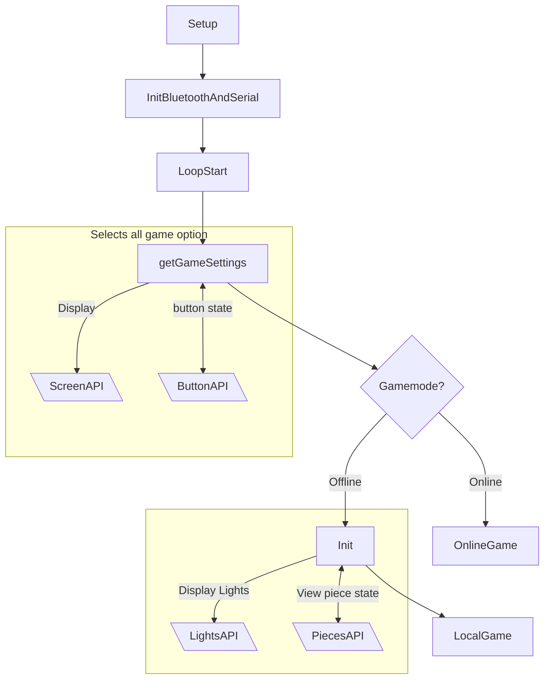

```mermaid
---
config:
  layout: dagre
---
flowchart TD
 subgraph sggetGameSettings["Selects all game option"]
        Screen[\"ScreenAPI"\]
        getGameSettings["getGameSettings"]
        ButtonSignal[\"ButtonAPI"\]
        getGameSettings -- Display --> Screen
        getGameSettings <-- button state --> ButtonSignal
  end

 subgraph sgInit[" "]
        Lights[\"LightsAPI"\]
        Init["Init"]
        Pieces[\"PiecesAPI"\]
        Init -- Display Lights --> Lights
        Init <-- View piece state --> Pieces
  end
    Setup["Setup"] --> InitBluetoothAndSerial["InitBluetoothAndSerial"]
    InitBluetoothAndSerial --> LoopStart["LoopStart"]
    LoopStart --> getGameSettings
    getGameSettings --> Gamemode{"Gamemode?"}
    Gamemode -- Offline --> Init
    Gamemode -- Online --> OnlineGame
    Init --> LocalGame["LocalGame"]
```

