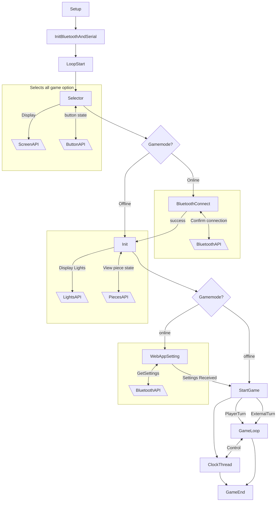

```mermaid
---
config:
  layout: dagre
---
flowchart TD
 subgraph sgSelector["Selects all game option"]
        Screen[\"ScreenAPI"\]
        Selector["Selector"]
        ButtonSignal[\"ButtonAPI"\]
  end
 subgraph sgBluetooth[" "]
        BluetoothAPI[\"BluetoothAPI"\]
        BluetoothConnect["BluetoothConnect"]
  end
 subgraph sgInit[" "]
        Lights[\"LightsAPI"\]
        Init["Init"]
        Pieces[\"PiecesAPI"\]
  end
 subgraph sgBluetooth2[" "]
        BluetoothAPI2[\"BluetoothAPI"\]
        WebAppSetting["WebAppSetting"]
  end
    Selector -- Display --> Screen
    Selector <-- button state --> ButtonSignal
    BluetoothConnect <-- Confirm connection --> BluetoothAPI
    Init -- Display Lights --> Lights
    Init <-- View piece state --> Pieces
    WebAppSetting <-- GetSettings --> BluetoothAPI2
    Setup["Setup"] --> InitBluetoothAndSerial["InitBluetoothAndSerial"]
    InitBluetoothAndSerial --> LoopStart["LoopStart"]
    LoopStart --> Selector
    Selector --> Gamemode{"Gamemode?"}
    Gamemode -- Offline --> Init
    Gamemode -- Online --> BluetoothConnect
    BluetoothConnect -- success --> Init
    Init --> Gamemode2{"Gamemode?"}
    Gamemode2 -- online --> WebAppSetting
    Gamemode2 -- offline --> StartGame["StartGame"]
    WebAppSetting -- Settings Received --> StartGame
    StartGame -- PlayerTurn --> GameLoop["GameLoop"]
    StartGame -- ExternalTurn --> GameLoop
    StartGame --> ClockThread["ClockThread"]
    GameLoop <-- Control --> ClockThread
    ClockThread --> GameEnd["GameEnd"]
    GameLoop --> GameEnd


```

