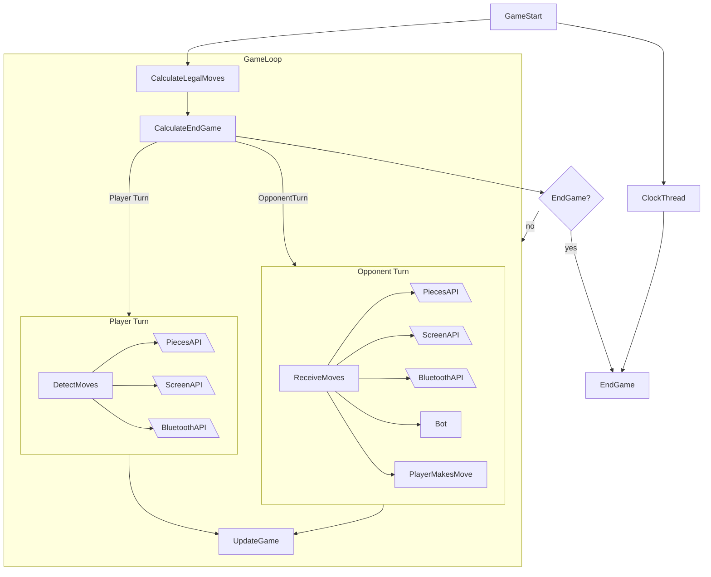

```mermaid
---
config:
  layout: dagre
---
flowchart TD
 subgraph GameLoop["GameLoop"]
        CalculateLegalMoves["CalculateLegalMoves"]
        PlayerTurn["PlayerTurn"]
        OpponentTurn["OpponentTurn"]
        CalculateEndGame["CalculateEndGame"]
        UpdateGame["UpdateGame"]
  end
 subgraph PlayerTurn["Player Turn"]
        DetectMoves["DetectMoves"]
        Pieces[\"PiecesAPI"\]
        Lights[\"ScreenAPI"\]
        Bluetooth[\"BluetoothAPI"\]
  end
 subgraph OpponentTurn["Opponent Turn"]
        ReceiveMoves["ReceiveMoves"]
        PlayerMakesMove["PlayerMakesMove"]
        Pieces2[\"PiecesAPI"\]
        Lights2[\"ScreenAPI"\]
        Bluetooth2[\"BluetoothAPI"\]
        Bot["Bot"]
  end
    DetectMoves --> Pieces & Lights & Bluetooth
    ReceiveMoves --> Pieces2 & Lights2 & Bluetooth2 & Bot
    ReceiveMoves --> PlayerMakesMove
    GameStart --> ClockThread["ClockThread"]
    GameStart["GameStart"] --> CalculateLegalMoves
    CalculateLegalMoves --> CalculateEndGame
    CalculateEndGame -- Player Turn --> PlayerTurn  
    CalculateEndGame -- OpponentTurn --> OpponentTurn 
    PlayerTurn --> UpdateGame
    OpponentTurn --> UpdateGame
    CalculateEndGame --> EndGameQ{"EndGame?"}
    EndGameQ -- yes --> EndGame["EndGame"]
    EndGameQ -- no --> GameLoop
    ClockThread --> EndGame
```