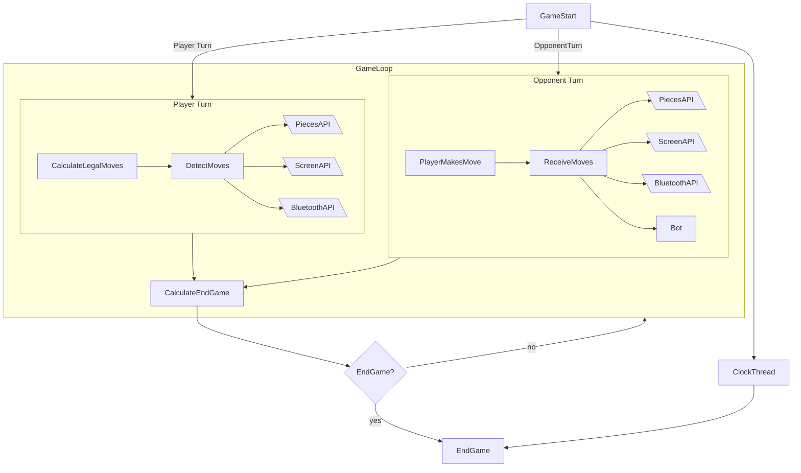

```mermaid
---
config:
  layout: dagre
---
flowchart TD
 subgraph GameLoop["GameLoop"]
        PlayerTurn["PlayerTurn"]
        OpponentTurn["OpponentTurn"]
        CalculateEndGame["CalculateEndGame"]
  end
 subgraph PlayerTurn["Player Turn"]
        DetectMoves["DetectMoves"]
        CalculateLegalMoves["CalculateLegalMoves"]
        Pieces[\"PiecesAPI"\]
        Lights[\"ScreenAPI"\]
        Bluetooth[\"BluetoothAPI"\]
  end
 subgraph OpponentTurn["Opponent Turn"]
        ReceiveMoves["ReceiveMoves"]
        PlayerMakesMove["PlayerMakesMove"]
        Pieces2[\"PiecesAPI"\]
        Lights2[\"ScreenAPI"\]
        Bluetooth2[\"BluetoothAPI"\]
        Bot["Bot"]
  end
    CalculateLegalMoves --> DetectMoves
    DetectMoves --> Pieces & Lights & Bluetooth
    PlayerMakesMove --> ReceiveMoves
    ReceiveMoves --> Pieces2 & Lights2 & Bluetooth2 & Bot
    GameStart["GameStart"] -- Player Turn --> PlayerTurn
    GameStart --> ClockThread["ClockThread"]
    GameStart -- OpponentTurn --> OpponentTurn
    PlayerTurn --> CalculateEndGame
    OpponentTurn --> CalculateEndGame
    CalculateEndGame --> EndGameQ{"EndGame?"}
    EndGameQ -- yes --> EndGame["EndGame"]
    EndGameQ -- no --> GameLoop
    ClockThread --> EndGame
```