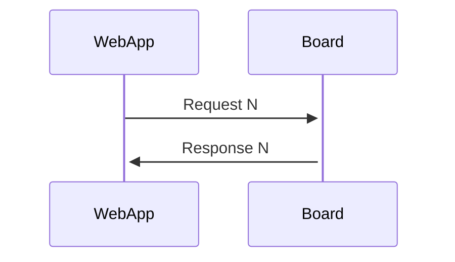

# Online game design

## Intro
When the user selects Online Play as the game mode in the chess app, the physical chessboard transitions into a completely stateless operating mode.
In this mode, the embedded system maintains no memory of past moves, game state, or player context.
All logic, validation, and state management are performed exclusively by the app. This will allow us to quickly jump from game to game without creating any errors.

The board serves as a pure input/output device that responds to commands and reports sensor readings on demand. Each interaction between the app and the board follows a strict one-request-one-response pattern. The board processes only one active request at a time, returning exactly one corresponding response.

This design ensures deterministic, low-latency communication and makes the board resilient to disconnections or resets: it can be restarted or reconnected at any moment without requiring synchronization or state restoration from previous sessions.

In this configuration. Our webapp will be a the client and the embedded system on the ESP32 will be the server. This means the webapp sends a request to the board and the board responds.

Note: To the ESP32. This stateless form only applies when in online mode. When playing locally, all chess logic is determined inside of the ESP32 and the state of the game is remembered.

## Requests
Here is a display of all available requests to allow our system to function with the required features. Requests will be made in a human readable json format.
Elements will have a preditermined value that is either a string or an int. To keep communication simple we will only use these two data types.
All request contain and ID and a request type for the embedded system to understand. A request will be answered by a response with the same ID.
In the case of an invalid request for which ever reason, a type `"error, error_reason"` will be sent.
If the request type is unknown or the format makes it so the system doesn't even know who can answer this request, `"error, unknown"` will be sent



### Available request
This request is used by the webapp to verify the board has an established communication working.

#### Request:
```json
{
    "id": 1,
    "type": "available"
}
```
#### Response:
```json
{
    "id": 1,
    "type": "ok"
}
```

### Set game request
This request is made to request the ESP32 to set up it's board in a certain arrangement. This request will be used to set up the board initially. Since the embedded system is stateless, all moves updating the board which originate on the webb app will be perceived as if a new game is started.

#### Request
The set_board request contains the following fields.
1. Bitboard of the game being played. The user will need to match this board to then proceed with sending a response. Since the ESP32 can't know which piece is where, the bit board will need to match. This bit board is in a u_int64 format.
2. An old move color, from and to field to allow the the display of the last move made by an opponent on the web app. The color of the LEDs will also be determined by the web app.
Note an old move can be set to -1, -1 if there is no old move to display
3. White and black clocks values will be sent from the web app. This will overide the current status of the clock on the esp32 which is actively counting down between requests.
4. The clock run down field is used for the board to determine which is the clock that will be run down following this request.
5. The timeout is used to tell state an error to the webapp that if the request has not been met in the desired time. The web app can determine what to do next
```json
{
    "id": 1,
    "type": "set_board",
    "board": 18446462598732906495,
    "old_move": {
        "color": [0, 0, 255],
        "from": 12,
        "to": 28
    },
    "clock": {
        "started": "true",
        "white": 50,
        "black": 60,
        "run_down": "w",
    },
    "timeout": 60
}
```

#### Response
The board will return type ok the moment the board is in the proper state it wishes to be in. This following error is likely to happen
The timeout error will have this format: `"type": "error, timedout"`.
```json
{
    "id": 1,
    "type": "ok",
}
```


### Make move request
This request is made to request the user of the board to play a legal move. Notice that this request is almost the same as the set game.
The fields for castling and the field for en passant is added, since the those information are needed in chess to properly understand the state of the board.
The extra time is also added to increase the players clock by that amount of seconds when the player finishes his move.
Colors are added to customize play

#### Request
```json
{
    "id": 1,
    "type": "make_move",
    "board": "RNBQKBNRPPPPPPPP................................pppppppprnbqkbr",
    "castling": "KQ.q",
    "en_passant": -1,
    "old_move": {
        "color": [0, 0, 255],
        "from": 12,
        "to": 28
    },
    "lifted_square_color": [0, 230, 0],
    "legal_move_color": [0, 255, 0],
    "illegal_move_color": [255, 0, 0],
    "clock": {
        "started": "true",
        "white": 50,
        "black": 60,
        "extra_time": 5,
        "run_down": "w",
    },
    "timeout": 60
}
```

#### Response
The board will return type ok the moment the board is in the proper state it wishes to be in. These errors are likely to happen
Proper position not set: `"type": "error, position not set"`.
The timeout error will have this format: `"type": "error, timedout"`.
Notice how the move doesn't contain a promotion field. The promotions will be determined on the web app.
```json
{
    "id": 1,
    "type": "ok",
    "move_from": 12,
    "move_to": 28
}
```

### Animation request
This request is made to send a custom animation to the ESP32 to display. This can be sent for any reason since the program is stateless as mentionned above.

#### Request
The animation request contains the following fields.
1. An animation list containing multiple animation states
2. A 64 element list of RGB values in which to light up the squares of the ESP32.
3. A time value to determine how long the lights will remain on for
```json
{
    "id": 1,
    "type": "animation",
    "animation": [
        {
            "board": [[0, 0, 255], [0, 0, 255], "..."],
            "time_ms" : 1000
        },
        {
            "board": [[0, 0, 0], [0, 0, 255], "..."],
            "time_ms" : 1000
        }
    ]
}
```
#### Response:
```json
{
    "id": 1,
    "type": "ok"
}
```


### End task
This request ends one of the tasks currently running. Since the server can only process a single task at a time, an end task request will end that task without needing to specify it.

#### Request
```json
{
    "id": 1,
    "type": "end_task"
}
```
#### Response:
```json
{
    "id": 1,
    "type": "ok"
}
```


### Close request
To terminate the webapps control over the stateless embedded system, the web app can send a close request to allow the esp32 to return to the top of the main loop and decide a new game mode if it wishes.
A termination works at any point, even if another task is in progress.

#### Request
```json
{
    "id": 1,
    "type": "close"
}
```
#### Response:
```json
{
    "id": 1,
    "type": "ok"
}
```